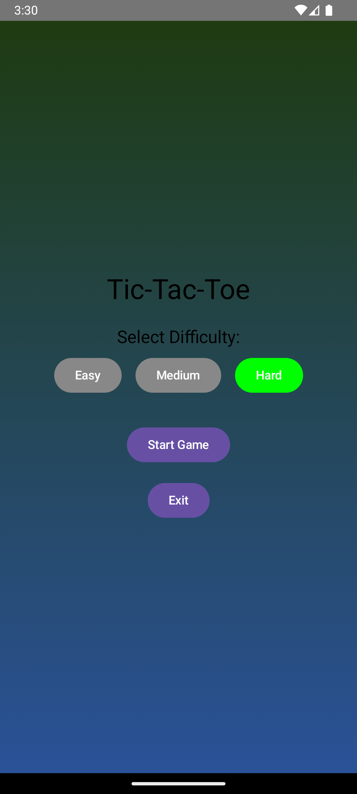
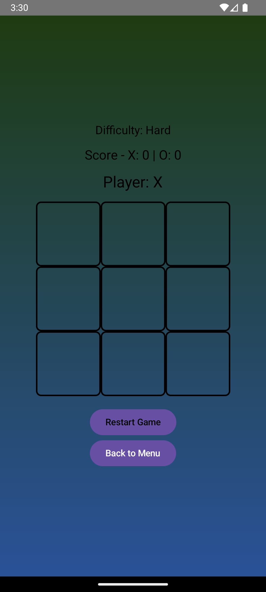

# 🎮 Tic-Tac-Toe

A modern Tic-Tac-Toe game built with **Jetpack Compose**. The game features **difficulty modes (Easy, Medium, Hard)**, **a beautiful gradient UI**, **smooth animations**, and **dark mode support**.

---

## **✈️ Features**
✅ **Single-player mode with AI opponent**  
✅ **Difficulty Levels: Easy, Medium, Hard (Unbeatable AI)**  
✅ **Animated UI with smooth transitions**  
✅ **Beautiful gradient background**  
✅ **Dark mode support**  
✅ **Score tracking for both players**  
✅ **Restart game & return to menu option**

---

## **📥 Installation & Setup**
### **1️⃣ Clone the Repository**
```sh
git clone https://github.com/GauravUp28/tic-tac-toe-compose.git
cd tic-tac-toe-compose
```

### **2️⃣ Open in Android Studio**
1. Open **Android Studio**.
2. Select **"Open an existing project"**.
3. Choose the cloned **`tic-tac-toe-compose`** folder.

### **3️⃣ Run the App**
- Click **Run ▶** or use the shortcut **Shift + F10** to launch the app.

---

## **🕹️ How to Play**
1. **Select Difficulty** on the menu screen.
2. **Start the game** and play as **"X"**.
3. **Tap on a grid cell** to make your move.
4. The **AI will respond** based on the selected difficulty.
5. The game tracks **wins & scores**.
6. Click **"Restart Game"** to play again or **"Back to Menu"** to return.

---

## **📸 Screenshots**
| 🏠 Main Menu                                 | 🎲 Game Screen                               | 🏆 Winner Screen                                 |
|----------------------------------------------|----------------------------------------------|--------------------------------------------------|
|  |  |  |

---

## **🎯 Future Enhancements**
🔜 **Multiplayer mode (Online via Firebase)**  
🔜 **Custom Avatars for Players (X & O images)**  
🔜 **Sound Effects & Vibrations**  
🔜 **Leaderboard & Achievements**

---

## **📄 License**
This project is open-source and available under the **MIT License**.

---

## **📬 Contact & Contribution**
👨‍💻 Created by **Gaurav Upadhyay**  
📧 Contact: [gauravupadhyay1100@gmail.com](mailto:gauravupadhyay1100@gmail.com)  
🌍 GitHub: [GauravUp28](https://github.com/GauravUp28)

Feel free to **contribute** by opening issues or submitting pull requests!

